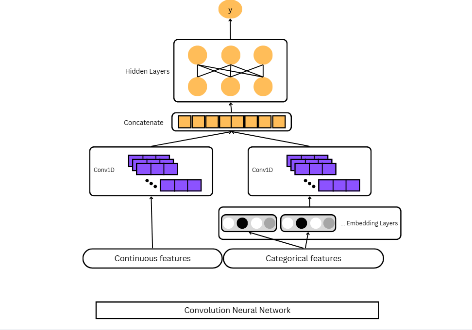
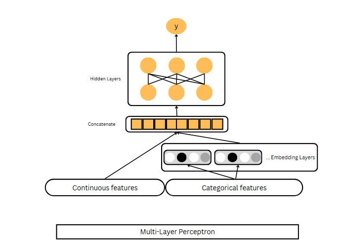
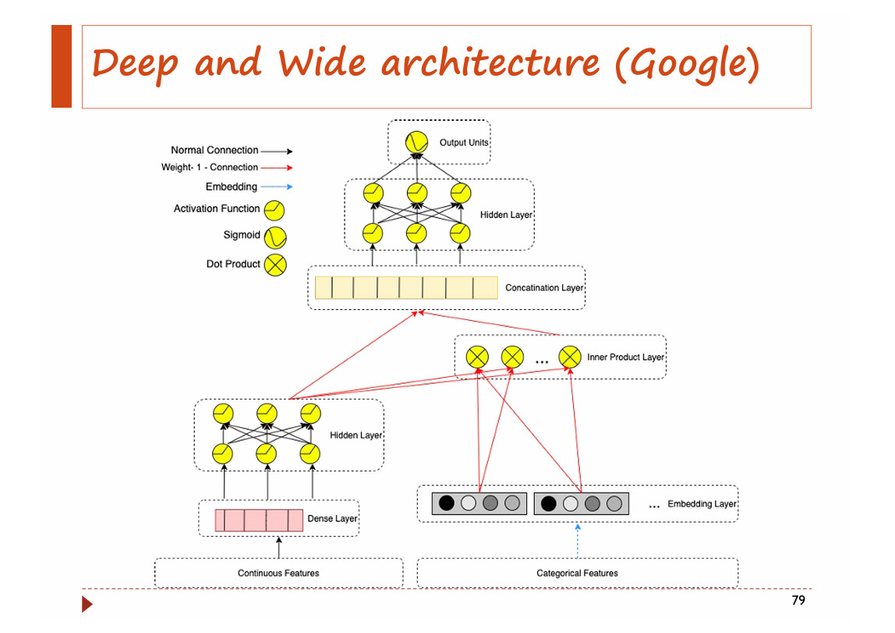

# Song-Prediction-Project

# Spotify project

The data this week comes from Spotify via the [`spotifyr` package](https://www.rcharlie.com/spotifyr/). [Charlie Thompson](https://twitter.com/_RCharlie), [Josiah Parry](https://twitter.com/JosiahParry), Donal Phipps, and Tom Wolff authored this package to make it easier to get either your own data or general metadata arounds songs from Spotify's API.

## Data description

| variable                 | class     | description                                                                                                                                                                                                                                                                                                                                                                                                                                                                                                        |
| :----------------------- | :-------- | :----------------------------------------------------------------------------------------------------------------------------------------------------------------------------------------------------------------------------------------------------------------------------------------------------------------------------------------------------------------------------------------------------------------------------------------------------------------------------------------------------------------- |
| track_id                 | character | Song unique ID                                                                                                                                                                                                                                                                                                                                                                                                                                                                                                     |
| track_name               | character | Song Name                                                                                                                                                                                                                                                                                                                                                                                                                                                                                                          |
| track_artist             | character | Song Artist                                                                                                                                                                                                                                                                                                                                                                                                                                                                                                        |
| track_popularity         | double    | Song Popularity (0-100) where higher is better                                                                                                                                                                                                                                                                                                                                                                                                                                                                     |
| track_album_id           | character | Album unique ID                                                                                                                                                                                                                                                                                                                                                                                                                                                                                                    |
| track_album_name         | character | Song album name                                                                                                                                                                                                                                                                                                                                                                                                                                                                                                    |
| track_album_release_date | character | Date when album released                                                                                                                                                                                                                                                                                                                                                                                                                                                                                           |
| playlist_name            | character | Name of playlist                                                                                                                                                                                                                                                                                                                                                                                                                                                                                                   |
| playlist_id              | character | Playlist ID                                                                                                                                                                                                                                                                                                                                                                                                                                                                                                        |
| playlist_genre           | character | Playlist genre                                                                                                                                                                                                                                                                                                                                                                                                                                                                                                     |
| playlist_subgenre        | character | Playlist subgenre                                                                                                                                                                                                                                                                                                                                                                                                                                                                                                  |
| danceability             | double    | Danceability describes how suitable a track is for dancing based on a combination of musical elements including tempo, rhythm stability, beat strength, and overall regularity. A value of 0.0 is least danceable and 1.0 is most danceable.                                                                                                                                                                                                                                                                       |
| energy                   | double    | Energy is a measure from 0.0 to 1.0 and represents a perceptual measure of intensity and activity. Typically, energetic tracks feel fast, loud, and noisy. For example, death metal has high energy, while a Bach prelude scores low on the scale. Perceptual features contributing to this attribute include dynamic range, perceived loudness, timbre, onset rate, and general entropy.                                                                                                                          |
| key                      | double    | The estimated overall key of the track. Integers map to pitches using standard Pitch Class notation . E.g. 0 = C, 1 = C♯/D♭, 2 = D, and so on. If no key was detected, the value is -1.                                                                                                                                                                                                                                                                                                                            |
| loudness                 | double    | The overall loudness of a track in decibels (dB). Loudness values are averaged across the entire track and are useful for comparing relative loudness of tracks. Loudness is the quality of a sound that is the primary psychological correlate of physical strength (amplitude). Values typical range between -60 and 0 db.                                                                                                                                                                                       |
| mode                     | double    | Mode indicates the modality (major or minor) of a track, the type of scale from which its melodic content is derived. Major is represented by 1 and minor is 0.                                                                                                                                                                                                                                                                                                                                                    |
| speechiness              | double    | Speechiness detects the presence of spoken words in a track. The more exclusively speech-like the recording (e.g. talk show, audio book, poetry), the closer to 1.0 the attribute value. Values above 0.66 describe tracks that are probably made entirely of spoken words. Values between 0.33 and 0.66 describe tracks that may contain both music and speech, either in sections or layered, including such cases as rap music. Values below 0.33 most likely represent music and other non-speech-like tracks. |
| acousticness             | double    | A confidence measure from 0.0 to 1.0 of whether the track is acoustic. 1.0 represents high confidence the track is acoustic.                                                                                                                                                                                                                                                                                                                                                                                       |
| instrumentalness         | double    | Predicts whether a track contains no vocals. "Ooh" and "aah" sounds are treated as instrumental in this context. Rap or spoken word tracks are clearly "vocal". The closer the instrumentalness value is to 1.0, the greater likelihood the track contains no vocal content. Values above 0.5 are intended to represent instrumental tracks, but confidence is higher as the value approaches 1.0.                                                                                                                 |
| liveness                 | double    | Detects the presence of an audience in the recording. Higher liveness values represent an increased probability that the track was performed live. A value above 0.8 provides strong likelihood that the track is live.                                                                                                                                                                                                                                                                                            |
| valence                  | double    | A measure from 0.0 to 1.0 describing the musical positiveness conveyed by a track. Tracks with high valence sound more positive (e.g. happy, cheerful, euphoric), while tracks with low valence sound more negative (e.g. sad, depressed, angry).                                                                                                                                                                                                                                                                  |
| tempo                    | double    | The overall estimated tempo of a track in beats per minute (BPM). In musical terminology, tempo is the speed or pace of a given piece and derives directly from the average beat duration.                                                                                                                                                                                                                                                                                                                         |
| duration_ms              | double    | Duration of song in milliseconds                                                                                                                                                                                                                                                                                                                                                                                                                                                                                   |

## Installation
- To run this project, first you need to install this packages:

  - pandas
  - numpy
  - scikit-learn
  - tensorflow
  - matplotlib
  - seaborn

## Features

### 1. Predict `popularity` with a Machine Learning model and with a Deep Learning model
- For both approaches, first, perform exploratory data analysis (EDA) to understand the data and preprocess it accordingly.
- Split the data into training and testing sets.

#### 1.1. Machine Learning:
  - Use regression models such as **Linear Regression, Decision Trees, Random Forest, SVR** to predict the popularity of a track based on its features.
  - Perform hyperparameter tuning using **Random Search**.

  - Evaluate the model using metrics **Mean Absolute Error (MAE), Mean Squared Error (MSE) and R-squared (R²)**.
#### 1.2. Deep Learning:
  - Build a neural network using frameworks like TensorFlow or Keras to predict track popularity.
  - Experiment with different architectures, activation functions, and optimization algorithms.

  

    
    
<strong>CNN Architecture</strong>

  

  

    
    
<strong>MLP Architecture</strong>

  

  - Evaluate the model using the same metrics as above.

### 2. Build a recommender systems with a Machine Learning approach and with a Deep Learning approach.
Suggest 5 tracks to listen to based on 5 tracks that a user has liked
#### 2.1. Machine Learning:
  - Use collaborative filtering and content-based filtering techniques to build a recommendation system.
  - Evaluate the recommender system based on the return songs.
#### 2.2. Deep Learning:
  - Build a neural network-based recommender system using Deep and Wide Architecture ([link](https://arxiv.org/abs/1606.07792)).
  

  - Experiment with different architectures and hyperparameters.
  - Evaluate the recommender system using the same metrics as above.
